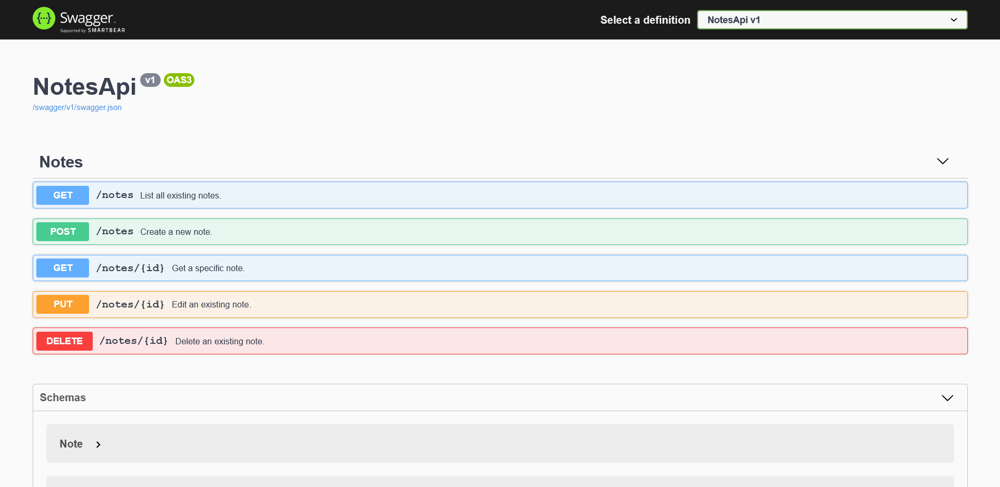

# NotesApi
## Running the Project
1. Install [The .NET 5.0 SDK](https://dotnet.microsoft.com/download/dotnet/5.0).
2. From within the root project directory, run `dotnet run --project ./NotesApi/NotesApi.csproj`. After running this, you should see in the terminal that it's running:
```
> dotnet run --project ./NotesApi/NotesApi.csproj
Building...
info: Microsoft.Hosting.Lifetime[0]
      Now listening on: https://localhost:5001
info: Microsoft.Hosting.Lifetime[0]
      Now listening on: http://localhost:5000
info: Microsoft.Hosting.Lifetime[0]
      Application started. Press Ctrl+C to shut down.
info: Microsoft.Hosting.Lifetime[0]
      Hosting environment: Development
info: Microsoft.Hosting.Lifetime[0]
      Content root path: C:\Users\willc\Desktop\NotesApi
```

3. Open [http://localhost:5000/swagger](http://localhost:5000/swagger) in your browser to view the API documentation.



4. Use a tool like cURL or Postman to make requests. Note that dotnet configures HTTPS by default. You may run into issues if you try to use the the HTTPS port `5001` or encountering HTTPS redirection even with the HTTP url. See [Troubleshooting](#Troubleshooting) for more info.

## Unit Tests
I've also added unit tests for the NotesController class. To execute the tests, run the following command from within the project root:
```
> dotnet test
```

## Examples
### Creating a note
**Request**
```
> curl --location --request POST -k 'http://localhost:5000/notes/' \
--header 'Content-Type: application/json' \
--data-raw '{
    "title": "Test title",
    "contents": "Test contents"
}'
```
**Response**
```
HTTP/1.1 200 OK
Date: Tue, 30 Mar 2021 20:54:05 GMT
Content-Type: application/json; charset=utf-8
Server: Kestrel
Transfer-Encoding: chunked
{"id":2}
```

### Listing all notes
**Request**
```
> curl --location --request GET -k 'http://localhost:5000/notes/'
```

**Response**
```
HTTP/1.1 200 OK
Date: Tue, 30 Mar 2021 20:58:23 GMT
Content-Type: application/json; charset=utf-8
Server: Kestrel
Transfer-Encoding: chunked
[{"id":1,"title":"Test title 2","contents":"Test contents 2"},{"id":2,"title":"Test title","contents":"Test contents"}]
```

## Source code
Within the project, open the *NotesApi* directory. You'll see some files that were created as standard .NET boilerplate: *appsettings.json*, *appsettings.Development.json*, *NotesApi.csproj*, and *Properties/launchSettings.json*.

Here's a rundown of the C# source files:

- **Controllers/NotesController.cs**: Provides the REST API endpoints for the required actions.
- **Exceptions/ResourceNotFoundException.cs**: Defines an exception class used when a requested note does not exist.
- **Models/CreateNoteResponse.cs**: Defines a class with only the ID of the newly created note, returned after note is created.
- **Models/ErrorResponse.cs**: Contains a class with an error message property to provide additional info to the API consumer if needed.
- **Models/Note.cs**: This contains a class which represents the Note as we persist it with our repository, and in this case, also how we present it to the API consumer.
- **Models/NoteRequest.cs**: Defines a class with a subset of the note fields we use when creating or editing a note.
- **Persistence/INotesRepository.cs**: Interface defining the persistence operations we need for this program.
- **Persistence/NotesRepository.cs**: Implements `INotesRepository` with a backing JSON file as suggested.
- **Program.cs**: Created as boilerplate. Program entrypoint.
- **Startup.cs**: Created as boilerplate, but I made some changes. In the `Configure` and `ConfigureServices` methods, I set up exception handling, document generation, and configured the Repository class as a dependency.

## Troubleshooting
### cURL complains about self-signed certificate
You may see the following message when using cURL:
```
curl: (60) SSL certificate problem: self signed certificate
More details here: https://curl.se/docs/sslcerts.html

curl failed to verify the legitimacy of the server and therefore could not
establish a secure connection to it. To learn more about this situation and
how to fix it, please visit the web page mentioned above.
```

**To fix: make sure you use the `-k` flag before the URLs in your command.**

### Postman states "SSL Error: Unable to verify the first certificate"
You may see the above error message displayed when using Postman. 

**To fix: disable SSL certificate validation within Postman at *File* > *Settings* > *General***.